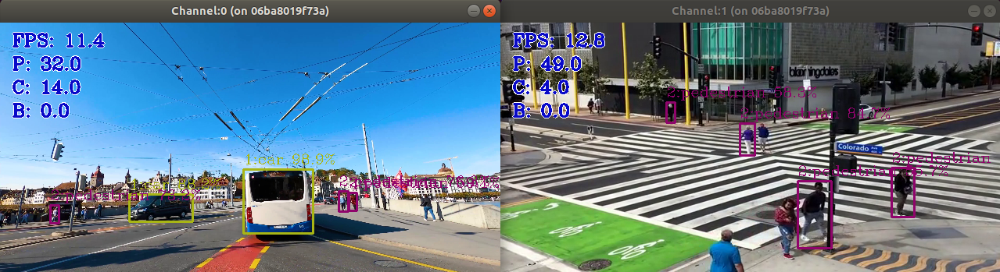
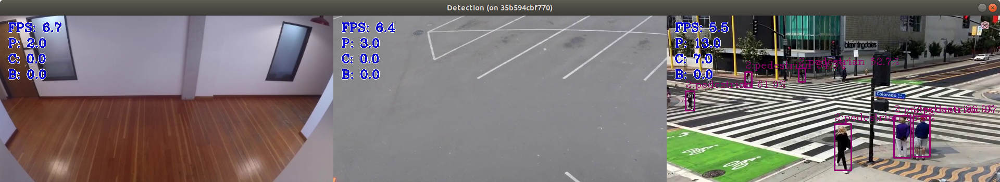

# Pedestrian and vehicle detection and tracking

OS: Ubuntu:18.04

# With 2 input videos


# With 3 input videos


## Introduction

This application count the total number of pedestrains,cars and bikes and displays the total count on on the frame

## How it Works
- The application uses openvino <a href=https://docs.openvinotoolkit.org/latest/omz_models_model_person_vehicle_bike_detection_crossroad_1016.html> person-vehicle-bike-detection-crossroad-1016 </a> to detect pedestrians,cars and bikes and take input from videos directory. It displays the counts on the frame as P(Pedestrains), C(Cars), B(Bikes).

## Setup
### Get the code
Clone the reference implementation
```
sudo apt-get update && sudo apt-get install git
git clone https://github.com/spsc0894/pedestrian_car_detection
```

## Pre-requisites

<a href=https://docs.docker.com/engine/install/ubuntu/>Docker CE`</a>

## Run the application

Change the current directory to the git-cloned application code location on your system:
```
cd pedestrian_car_detection
```
Install using below command:
```
sudo make install
```

Execute using below command
```
sudo make execute
```

# To Do

Integrate this application with grafana dashboard as in <a href=https://github.com/spsc0894/face_counter>face counter</a> and display the metrics on dashboard.

# References:
1. Openvino utilities:<a href=https://github.com/openvinotoolkit/open_model_zoo/tree/2021.3/demos/common/python> open model zoo</a>
2. Openvino python <a href=https://github.com/openvinotoolkit/open_model_zoo/blob/2021.3/demos/object_detection_demo/python/object_detection_demo.py>object detection demo</a>
